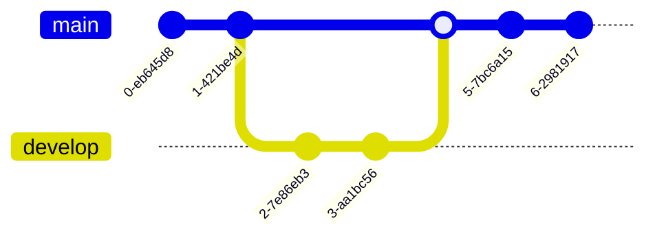

Esto es una prueba

# mi primera pagina con Markdown

## Titulo

**Negrita**

_cursiva_

> esto es una cita
>
>>> y esto es otra cita

`printf("hola mundo")`

- [x] Write the press release
- [ ] Update the website
- [ ] Contact the media

| Syntax | Description |
| ----------- | ----------- |
| Header | Title |
| Paragraph | Text |

```
{
  "firstName": "John",
  "lastName": "Smith",
  "age": 25
}
```

Here's a sentence with a footnote. [^1]

[^1]: This is the footnote.

### My Great Heading {#custom-id}

term
: definition

~~The world is flat.~~

 I need to highlight these ==very important words==.



**My document**

Lorem ipsum dolor sit amet...

_Another section_

Consectetur adipiscing elit, sed do eiusmod.

# My document

Lorem ipsum dolor sit amet...

## Another section

Consectetur adipiscing elit, sed do eiusmod.
